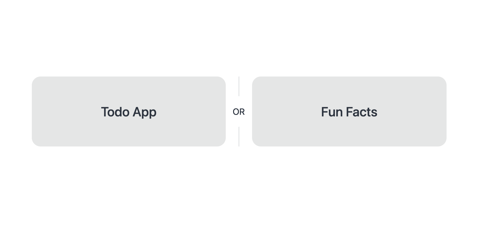
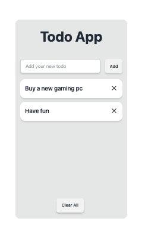
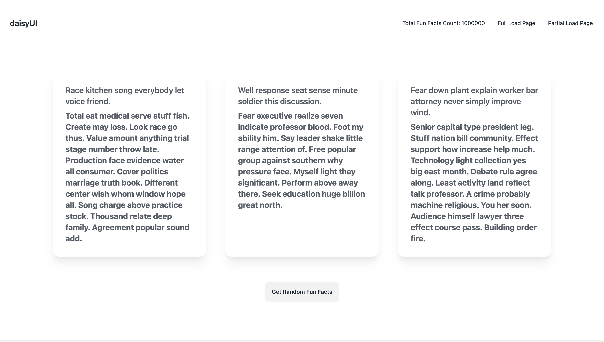

# FastAPI + Jinja2 + HTMX + Docker - TODO App Showcase

## Overview

This project is a simple showcase of a TODO App implemented using FastAPI, HTMX, Jinja2 with DaisyUI, and Tailwind CSS. The goal is to demonstrate the efficiency and synergy of these technologies in a web application.

Additionally, a fake fun facts generator has been integrated for a playful touch. Access it through the following links:

- Home: http://localhost:8000
- Full Load Fun Facts: http://localhost:8000/fun-fact-full-load
- Partial Load Fun Facts: http://localhost:8000/fun-fact-partial-load





Explore the seamless integration of FastAPI, HTMX, Jinja2, DaisyUI, and Tailwind CSS in this demonstration

### Technologies Used

1. **FastAPI**

   - FastAPI is a modern, fast (high-performance), web framework for building APIs with Python 3.8+ based on standard Python type hints.

2. **HTMX**

   - HTMX is a lightweight JavaScript library for creating dynamic, seamless user interfaces. It allows for updating parts of a webpage using AJAX requests, providing a smooth user experience.

3. **Jinja2**

   - Jinja2 is a template engine for Python that simplifies the process of integrating dynamic content into web applications. It enables the creation of dynamic templates, allowing developers to seamlessly blend Python logic with HTML for efficient and maintainable code.

4. **Tailwind CSS with DaisyUI**
   - Tailwind CSS is a utility-first CSS framework that provides low-level utility classes to build designs directly in your markup. DaisyUI, as an extension to Tailwind CSS, enriches the framework with additional components and features, offering a comprehensive toolkit for crafting modern and responsive user interfaces with ease.

### Features

- List TODO items
- Create new TODO items
- Remove specific TODO items
- Clear all TODO items
- Get random fake Fun Facts

### Development Setup

To build the application and its dependencies:

```bash
make build
```

To start the application:

```bash
make up
```

To shut down the application:

```bash
make down
```

To run tests (ensure the application is running first):

```bash
make tests
```

### Makefile Commands

- `update-deps`: Update project dependencies using pip-compile.
- `build`: Build the Docker image with the application.
- `up`: Start the application and its dependencies.
- `down`: Shut down the application.
- `attach`: Attach to the running application container.
- `db-migrate`: Generate Alembic database migrations.
- `db-upgrade`: Apply Alembic database migrations.
- `db-downgrade`: Roll back Alembic database migrations.
- `migration-history`: View Alembic migration history.
- `bash`: Open a bash shell in the running application container.
- `run-build`: Build and run the application without using Docker Compose.
- `run`: Run the application in a Docker container.
- `run-tests`: Run tests in a Docker container.
- `tests`: Run application tests in the container.
- `bootstrap`: Execute the bootstrap script in the running application container.
- `e2e-tests`: Build and run end-to-end tests using a separate Docker container.

### Pre-commit Hooks

The project uses pre-commit with the following hooks:

- `autoflake`: Removes unused imports and variables.
- `flake8`: Checks for PEP 8 compliance and code style.
- `isort`: Sorts import statements.
- `black`: Formats code using the Black code formatter.

### Security

`CORS Protection`:
Cross-Origin Resource Sharing (CORS) is a security feature that controls which web domains are permitted to access resources from your web application, preventing unauthorized cross-origin requests.

### Performance tests

Comprehensive performance tests have been crafted using the Locust tool for our Python project. Docker Compose services `perf_tests_full` and `perf_tests_partial` orchestrate the execution of performance scripts.

- perf_tests_full:
  - Run a full load tests by visiting http://localhost:8089/.
- perf_tests_partial:
  - Run a partial load tests by visiting http://localhost:8090/.

Commands:

- `make perf-tests-full`
- `make perf-tests-partial`

### E2E tests

To ensure the proper functioning of our application and validate the correct display of elements, we utilize Playwright to conduct E2E tests.

Use the following commands to run E2E tests:

- `make e2e-tests-build`: Build the Docker image for E2E tests.
- `make e2e-tests-bash`: Run an interactive Bash shell inside the E2E test Docker container for manual testing.
- `make e2e-tests`: Execute Playwright-based E2E tests using pytest.

Before running the E2E tests, make sure to install dependencies and set up the testing environment. Also, ensure the application is running locally or on the specified base URL.

_Feel free to explore and modify the project to suit your needs!_
